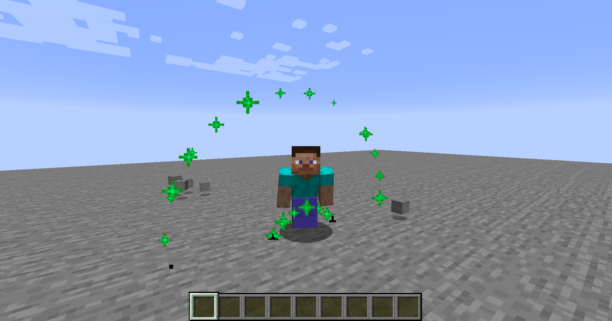

# Custom Minecraft Server

---
    Disclaimer: This code is not production-ready!
    I do not recommend using it, it is designed to be a protocol reference
    The code is quite old and there are some design flaws.
--- 

I'm currently working on a recode for the latest version. 

## Features
- MOTD
- Gamemode-Switching
- Gamemode-Anticheat (prevents users from cheating items in survival mode)
- Join
- Chat
- Time
- Data watchers
- Mojang Brigadier implementation (with tab completion)
- Particles
- Item dropping (but no pickup)
- Basic entity handling (spawning)
- Uses vanilla-registry json files
- DOS-Protection

## Auto-generation
The files inside the folder src/main/java/de/emilschlampp/customMinecraftServer/utils/generated are auto-generated.

## Design Flaws
- One writing thread, each connection has an own reading thread
- The writing thread doesn't have locking/sleeping, so it will push an entire core to 100%
- It uses pre-captured dat files (could we generate them dynamicly?)
- Not fully object-oriented

## Special Thanks:
- To wiki.vg for the nice protocol documentation!